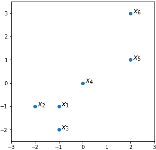

Consider a dataset x₁, …, x₆ in R²:

```python
data = np.array([
    [-1, -1],
    [-2, -1],
    [-1, -2],
    [0, 0],
    [2, 1],
    [2, 3]
])
```

Graphically:



Throughout the quiz, assume the usual (Euclidean) metric in R².

1. Calculate single-linkage hierarchical clustering of this dataset into 2 clusters.
- [ ] {x₁, x₂, x₃, x₄, x₅}, {x₆}
- [x] {x₁, x₂, x₃, x₄}, {x₅, x₆}
- [ ] {x₁, x₂, x₃}, {x₄, x₅, x₆}
- [ ] {x₂, x₃}, {x₁, x₄, x₅, x₆}

2. Given two initial centers x₁ and x₄, calculate K-means clustering of the dataset. To break ties, assume the point doesn't leave its current cluster when equally close to more than one center.
- [ ] {x₁, x₂, x₃, x₄, x₅}, {x₆}
- [ ] {x₁, x₂, x₃, x₄}, {x₅, x₆}
- [x] {x₁, x₂, x₃}, {x₄, x₅, x₆}
- [ ] {x₂, x₃}, {x₁, x₄, x₅, x₆}

3. Given the hyperparameters of DBSCAN ε=2 and m=2, how many non-noise clusters would be discovered by DBSCAN in the dataset?
- [x] 1
- [ ] 2
- [ ] 3
- [ ] 4

4. More generally, what would be the output of DBSCAN when ε is large and m is small w.r.t. the density of points in a given point cloud?
- [ ] each point is a separate non-noise cluster
- [ ] a few non-noise clusters are identified, and the rest is noise
- [ ] all points are noise
- [x] all points are grouped together into a single cluster

5. Given the clustering {x₁, x₂, x₃}, {x₄, x₅, x₆}, calculate silhouette averaged over all points:
- [ ] 0.35
- [x] 0.46
- [ ] 0.57
- [ ] 0.68

6. Slope of the first principal component in the dataset is approximately:
- [ ] 15°
- [ ] 30°
- [x] 45°
- [ ] 60°

7. What would be the projection of x₆ onto the first principal component?
- [ ] -1.41
- [ ] 0.00
- [ ] 2.09
- [x] 3.56

8. Which of the following nonlinear 1-dimensional projections of the dataset preserves pairwise distances between the points (in the sense of multidimensional scaling objective) as good as possible?
- [ ] x₁ → -1.34, x₂ → -1.98, x₃ → -2.46, x₄ → 0.00, x₅ → 2.09, x₆ → 3.68
- [x] x₁ → -1.34, x₂ → -2.46, x₃ → -1.98, x₄ → 0.00, x₅ → 2.09, x₆ → 3.68
- [ ] x₁ → -1.67, x₂ → -1.65, x₃ → -2.46, x₄ → 0.00, x₅ → 2.09, x₆ → 3.68
- [ ] x₁ → -1.67, x₂ → -2.46, x₃ → -1.65, x₄ → 0.00, x₅ → 2.09, x₆ → 3.68
